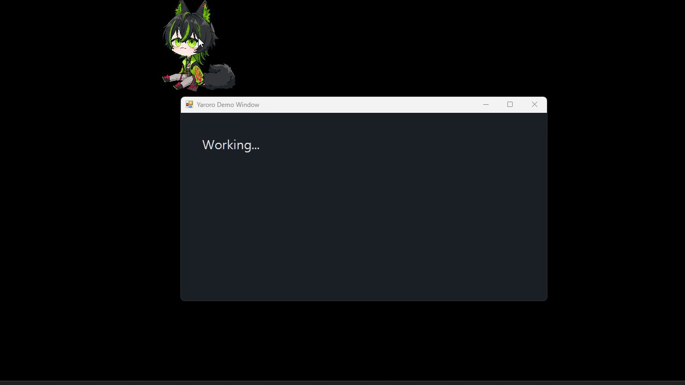
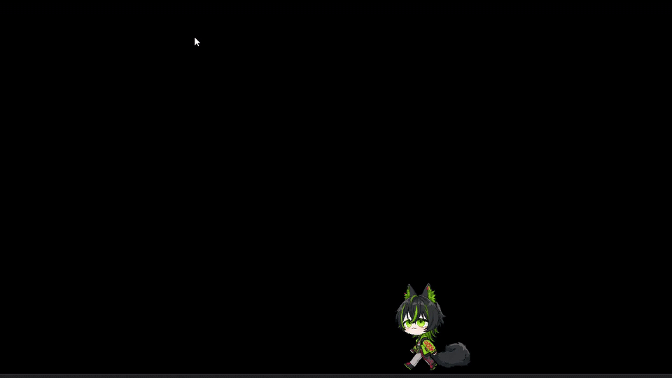
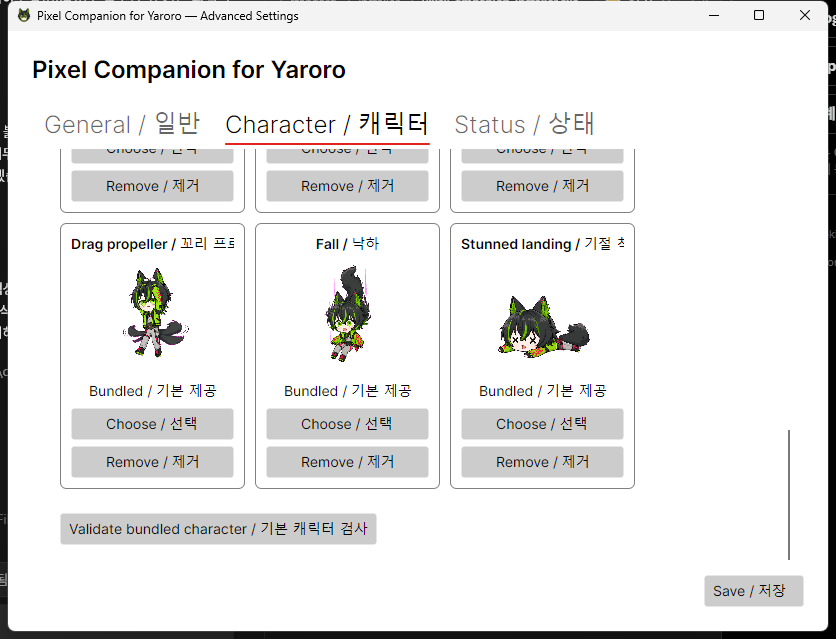

<div align="center">

```text
┌──────────────────────────────────────────┐
│   PIXEL COMPANION FOR YARORO  v0.5.3     │
│          화면 한쪽에서, 조용히 함께       │
└──────────────────────────────────────────┘
```

**야로로가 바탕화면과 프로그램 창 위를 천천히 돌아다니는 데스크톱 컴패니언**

[](Directory.Build.props)
[](https://dotnet.microsoft.com/)
[](https://avaloniaui.net/)
[](.)
[](.)
[](LICENSE)

[한국어](README.md) | [English](README.en.md)

<br>



</div>

---

## Pixel Companion for Yaroro

야로로가 화면 한쪽을 천천히 걷고, 가끔 밥을 먹거나 잠들고, 마우스로 들어 올리면 대롱대롱 따라옵니다. 바탕화면뿐 아니라 열어 둔 프로그램 창의 제목 표시줄에도 올라갈 수 있습니다.

마우스를 빼앗거나 창을 강제로 움직이지 않습니다. 화면 한가운데를 오래 가리지도 않습니다. 귀여운 움직임은 남기되 사용자의 일은 방해하지 않는 것을 가장 중요한 원칙으로 삼았습니다.

생성형 AI와 온라인 AI API는 사용하지 않습니다. 행동과 대사는 상태, 조건, 확률, 우선순위와 쿨다운을 조합해 결정합니다. 핵심 기능은 인터넷 연결 없이 작동하고 설정과 캐릭터 상태는 컴퓨터 안에 저장됩니다.

<p align="center">
  
</p>

---

## 지금 할 수 있는 것

| 기능 | 설명 |
|---|---|
| 걷기와 휴식 | 계속 걷기만 하지 않고 천천히 이동한 뒤 충분히 쉽니다. |
| 창 위 이동 | 프로그램 창의 제목 표시줄을 발판으로 삼아 걷습니다. |
| 창 장애물 | 앞쪽 창이 길을 가리면 벽처럼 인식하고 방향을 바꿉니다. |
| 드래그와 착지 | 드래그 중 초록색 창·파란색 바탕화면 착지선을 확인하고 원하는 곳에 놓을 수 있습니다. |
| 야로로 낙하 반응 | 옮기는 동안 꼬리를 프로펠러처럼 돌리고, 높은 곳에서 떨어지면 `X X` 눈으로 잠깐 기절합니다. |
| 돌보기 | 배고픔·청결도·행복도·피로도·친밀도를 확인하고 밥·놀이·쓰다듬기·청소·수면으로 돌봅니다. |
| 타이머 | 5·10분 일반 타이머, 25·50분 집중, 5분 휴식과 사용자 지정 시간을 제공합니다. |
| 내 대사 | 우클릭 메뉴에서 한국어·영어 대사를 추가하고 바로 미리 볼 수 있습니다. |
| 내 이미지 | PNG, JPG, JPEG, GIF를 동작별로 끌어 놓아 캐릭터를 바꿀 수 있습니다. |
| 조용한 실행 | 트레이에서 표시·숨기기·일시정지·방해 금지·자동 시작을 관리합니다. |
| 안전한 저장 | JSON을 임시 파일과 백업을 거쳐 저장하고 손상 시 복구합니다. |

야로로의 기본 동작은 정면, 뒷모습, 걷기 1·2·3, 밥 먹기 1·2, 잠자기 1·2, 꼬리 프로펠러, 낙하와 기절 착지로 구성되어 있습니다. 사람 캐릭터에 맞춰 사료가 아니라 밥과 반찬을 먹습니다.

<p align="center">
  
</p>

---

## 설치하기

Windows 10·11 x64를 먼저 지원합니다.

1. [최신 GitHub Release](https://github.com/ByteLab-1520/PixelCompanion/releases/latest)를 엽니다.
2. `PixelCompanion-Yaroro-Installer.exe`를 내려받습니다.
3. 설치 파일을 실행한 뒤 시작 메뉴에서 **Pixel Companion for Yaroro**를 실행합니다.

[야로로판 설치 파일 바로 받기](https://github.com/ByteLab-1520/PixelCompanion/releases/latest/download/PixelCompanion-Yaroro-Installer.exe)

현재 설치 파일에는 코드 서명이 없습니다. Windows가 게시자를 확인할 수 없다는 SmartScreen 경고를 표시할 수 있으므로 반드시 이 저장소의 Release에서 내려받고, 함께 제공되는 SHA-256 파일과 비교해 주세요.

기존 Pixel Companion 기본판이 설치된 컴퓨터에 야로로판을 설치하면 프로그램 충돌을 막기 위해 기본판을 먼저 제거합니다. 기존 기본판의 사용자 설정과 캐릭터 데이터는 삭제하지 않습니다.

---

## 캐릭터 설정

고급 설정의 `Character / 캐릭터` 탭에는 야로로의 기본 이미지가 처음부터 표시됩니다. 원하는 칸에 다른 이미지를 끌어 놓거나 `선택` 버튼으로 가져올 수 있습니다.

<p align="center">
  
</p>

| 이미지 칸 | 사용되는 상황 |
|---|---|
| `기본` | 쉬거나 인사할 때 |
| `뒷모습` | 뒤쪽을 바라볼 때 |
| `걷기 1 · 2 · 3` | 이동 애니메이션 |
| `밥 먹기 1 · 2` | 먹이 주기 |
| `잠자기 1 · 2` | 재우기 |
| `꼬리 프로펠러` | 마우스로 옮길 때 |
| `낙하` | 놓은 뒤 떨어질 때 |
| `기절 착지` | 높은 곳에서 착지했을 때 |

- 20MB 이하 `PNG`, `JPG`, `JPEG`, `GIF`를 지원합니다.
- 확장자뿐 아니라 실제 이미지 형식도 확인합니다.
- GIF는 현재 첫 프레임을 사용합니다.
- 사용자 이미지가 없는 칸은 야로로 기본 이미지로 돌아갑니다.
- 가져온 이미지는 사용자 데이터 폴더에 복사되므로 원본 파일을 옮겨도 유지됩니다.

---

## 대사 편집

캐릭터를 우클릭하고 `대사 편집...`을 선택하면 별도 프로그램 없이 대사를 고칠 수 있습니다.

- 클릭, 밥 먹기, 놀아주기, 잠자기 대사를 한국어와 영어로 나눠 관리합니다.
- 출력 확률, 최소 친밀도, 재사용 대기시간, 배고픔·피로도·행복도와 시간대 조건을 설정합니다.
- `{time}`을 넣으면 현재 시각으로 바뀝니다.
- 저장하기 전에 닫으면 편집창 위에 확인창을 표시해 변경 내용을 실수로 잃지 않게 합니다.
- 저장한 대사는 캐릭터를 다시 실행하지 않아도 곧바로 반영됩니다.

야로로의 기본 한국어 인사는 한 문장입니다.

> 안녕? 야로로대장이야

---

## v0.5.3 Hotfix에서 달라진 점

- 드래그 중 착지할 창이나 바탕화면을 미리 표시하고, 놓은 뒤 다른 표면으로 바뀌지 않게 했습니다.
- 창 아래로 충분히 끌어내리면 이전 창을 후보에서 제외해 바탕화면으로 쉽게 옮길 수 있습니다.
- `Esc`로 드래그를 취소하고 원래 위치로 돌아갈 수 있습니다.
- 야로로가 꼬리 프로펠러 자세로 매달리고, 더 빠르게 낙하한 뒤 높은 곳에서는 기절 착지를 합니다.
- 상태 확인, 쓰다듬기, 청소하기, 재우기와 깨우기를 추가했습니다.
- 프로그램을 오래 사용하지 않았을 때 잠들고, 돌아오면 쿨다운을 적용해 인사합니다.
- 일반·집중·휴식·사용자 지정 타이머를 추가했습니다.
- 대사에 배고픔·피로도·행복도·시간대 조건을 설정할 수 있습니다.
- 동작이 한눈에 보이는 꼬리 프로펠러와 낙하·기절 착지 전용 이미지를 사용합니다.
- 전체 화면 프로그램을 감지하면 기본적으로 화면 오른쪽 아래 모서리에 앉아 조용히 기다리고, 종료 후 이전 자리로 돌아갑니다.
- 고급 설정의 긴 한·영 항목명이 입력창과 겹치지 않도록 자동 줄바꿈합니다.
- 낙하 중 일반 애니메이션이 끼어들어 기본 이미지가 깜빡이던 문제를 수정했습니다.
- 높은 곳에 착지한 뒤 `X X` 상태를 2.5초 동안 보여 줍니다.
- 이전 버전에서 저장된 전체 화면 `숨기기` 기본값을 한 번만 `모서리 대기`로 이전합니다.

자세한 기록은 [v0.5.3 Hotfix 변경사항](docs/releases/v0.5.3.md)에서 볼 수 있습니다.

---

## 소스에서 실행하기

필요한 환경:

```text
.NET SDK   10.0
Avalonia   12.1
Windows    10 / 11
```

야로로판을 빌드하고 실행하려면 저장소 루트에서 다음 명령을 사용합니다.

```powershell
dotnet restore PixelCompanion.slnx
dotnet build PixelCompanion.slnx -c Release -p:ProductEdition=Yaroro
dotnet run --project src/PixelCompanion.Desktop -c Release -p:ProductEdition=Yaroro
```

고급 설정:

```powershell
dotnet run --project src/PixelCompanion.Config -c Release -p:ProductEdition=Yaroro
```

핵심 검사:

```powershell
dotnet run --project tests/PixelCompanion.Core.Tests -c Release -p:ProductEdition=Yaroro
```

---

## Windows 인스톨러 만들기

[Inno Setup](https://jrsoftware.org/isinfo.php)을 설치한 뒤 실행합니다.

```powershell
powershell -ExecutionPolicy Bypass -File .\scripts\Build-WindowsInstaller.ps1 -Version 0.5.3 -Edition Yaroro
```

완성된 설치 파일:

```text
artifacts\windows\yaroro\installer\PixelCompanion-Yaroro-Installer.exe
```

설치·버전·제거 검사를 통과한 파일만 Release에 게시합니다. 자세한 과정은 [Windows 패키징 안내서](packaging/windows/README.md)와 [릴리스 절차](docs/releasing.md)를 참고해 주세요.

---

## 로드맵

기능 수를 빠르게 늘리기보다 야로로가 자연스럽고 안정적으로 움직이는 것을 먼저 다듬습니다.

| 버전 | 목표 |
|---|---|
| `v0.4.4` | 낙하 중 다시 잡기, 대사 확인창, 기본 이미지 미리보기 안정화 |
| `v0.5.3` | 안정적인 낙하·기절 착지, 설정 UI 정렬과 전체 화면 모서리 대기 이전 |
| `v0.6.0` | 자리 비움·복귀, 전체 화면, 배터리·충전, 음악·영상 반응 |
| `v0.7.0` | 스프라이트 시트, FPS, 기준점, 히트박스와 소품 편집 |
| `v0.8.0` | macOS Apple Silicon·x64 시험 지원 |
| `v1.0.0` | 장시간 실행, 성능, 복구, 접근성과 배포 안정화 |

세부 계획은 [로드맵 문서](docs/roadmap.md)에 정리합니다.

---

## 사용자 데이터와 개인정보

야로로판의 사용자 데이터는 Windows에서 다음 위치에 저장됩니다.

```text
%LOCALAPPDATA%\PixelCompanion-Yaroro
```

키보드 입력 내용, 비밀번호, 화면 이미지, 마이크 음성과 개인 파일 내용을 수집하지 않습니다. 원격 분석과 계정 시스템도 포함하지 않습니다. 필요한 상태 정보는 가능한 범위에서 컴퓨터 안에서만 처리합니다.

---

## 라이선스와 캐릭터 자산

프로그램 소스 코드는 [MIT License](LICENSE)로 배포합니다.

야로로 캐릭터 이미지와 참고 자산은 MIT 소프트웨어 라이선스에 포함되지 않습니다. 원본 캐릭터와 이미지의 권리는 각 권리자에게 있으며, 저장소의 캐릭터 자산을 별도의 허락 없이 추출하거나 재배포해서는 안 됩니다.

기술 구조에는 일반판도 남아 있으며 빌드와 테스트를 계속 지원합니다. 저장소의 기본 소개와 Windows 권장 설치 파일은 야로로판을 기준으로 안내합니다.

---

<div align="center">

**Pixel Companion for Yaroro**

_화면 한쪽에서, 조용히 함께._

</div>
