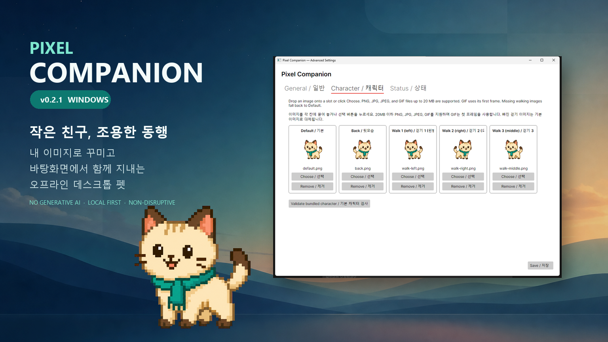
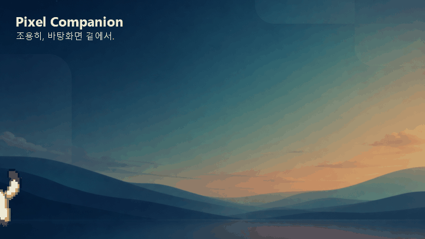
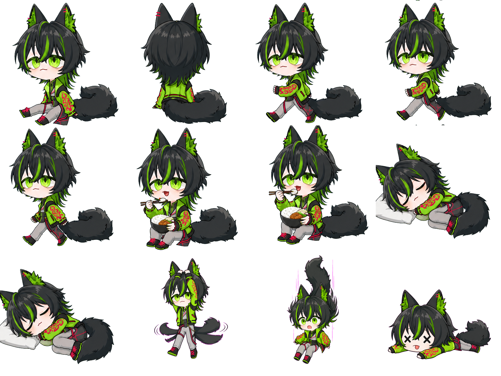
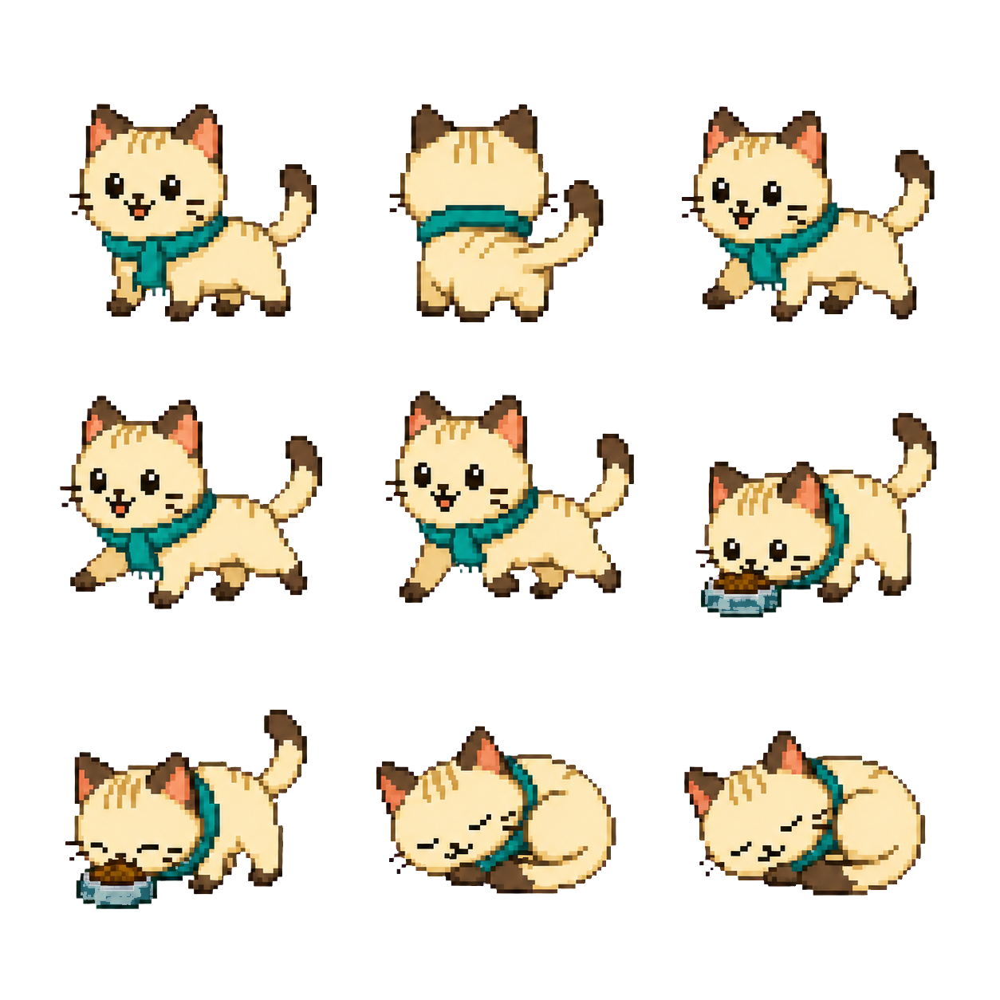
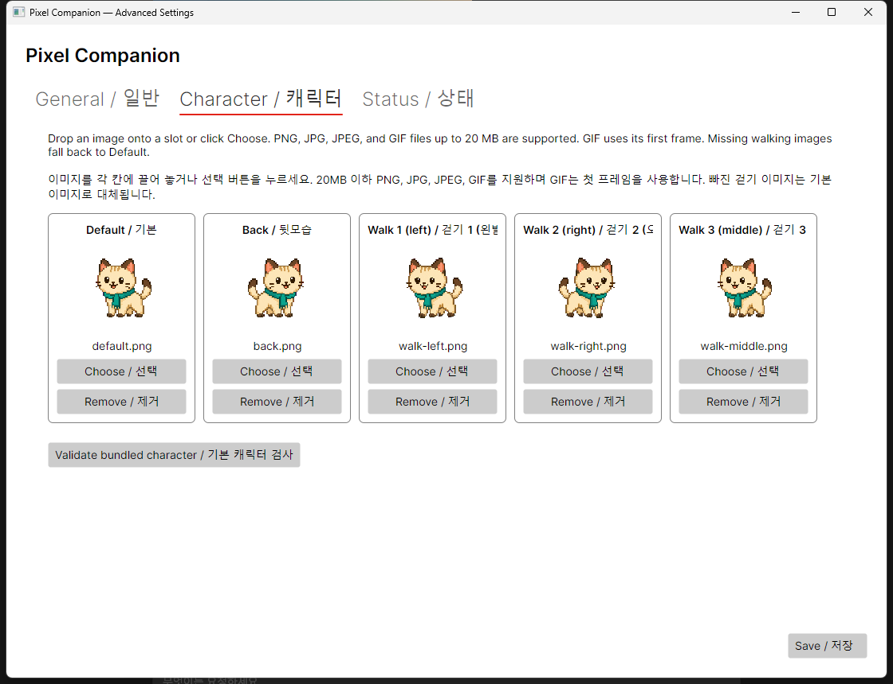

<div align="center">

```text
┌──────────────────────────────────────┐
│      PIXEL COMPANION  v0.4.3         │
│       작은 친구, 조용한 동행         │
└──────────────────────────────────────┘
```

**작업을 방해하지 않고, 바탕화면 한쪽에서 함께 지내는 도트 데스크톱 펫**

[](Directory.Build.props)
[](https://dotnet.microsoft.com/)
[](https://avaloniaui.net/)
[](.)
[](.)
[](LICENSE)

[한국어](README.md) | [English](README.en.md)

<br>



</div>

---

## ░░ Pixel Companion은 어떤 프로그램인가요?

Pixel Companion은 바탕화면 위를 천천히 돌아다니는 작은 도트 캐릭터입니다.

마우스를 빼앗거나 창을 강제로 움직이지 않습니다. 화면 한가운데를 오래 가리지도 않습니다. 사용자가 집중하고 있을 때는 조용히 머물고, 잠깐 쉬는 순간에는 가벼운 반응으로 존재감을 보여 주는 방향을 목표로 합니다.

생성형 AI나 온라인 AI 서비스는 사용하지 않습니다. 캐릭터의 행동은 상태, 조건, 확률, 쿨다운과 대사 데이터를 조합해 만듭니다. 핵심 기능은 인터넷 연결 없이 작동하며, 사용자 데이터도 컴퓨터 안에 보관합니다.

<p align="center">
  
</p>

| | |
|---|---|
| 🐾 | 걷기, 기다리기, 드래그, 낙하와 착지 |
| 🖼️ | 내 이미지로 캐릭터 모습 설정 |
| 💬 | 상황과 친밀도에 따른 짧은 대사 |
| 🍙 | 배고픔, 행복도, 피로도 같은 다마고치 상태값 |
| 🌐 | 한국어·영어 지원 |
| 🔒 | 온라인 계정과 원격 분석 없이 로컬 저장 |
| 🪟 | Windows 10·11 x64 우선 지원 |

---

## ░░ 지금 할 수 있는 것

- 투명한 캐릭터 창을 바탕화면 위에 표시합니다.
- 픽셀이 흐려지지 않도록 최근접 이웃 방식으로 이미지를 확대합니다.
- 실제 경과 시간을 기준으로 천천히 걷고, 걷는 사이에는 충분히 쉬도록 움직입니다.
- 캐릭터를 마우스로 잡아 옮기면 놓인 자리로 떨어진 뒤 다시 균형을 잡습니다.
- 클릭, 먹이 주기, 놀아주기 같은 간단한 상호작용을 지원합니다.
- 트레이 아이콘과 우클릭 메뉴에서 표시, 숨기기, 일시정지와 설정을 바꿀 수 있습니다.
- 실행 프로그램과 분리된 고급 설정 프로그램이 같은 사용자 데이터를 공유합니다.
- 설정과 다마고치 상태를 안전하게 저장하고, 손상된 파일은 백업에서 복구합니다.
- 한국어 번역이 없으면 영어를, 영어도 없으면 번역 키를 표시해 프로그램이 멈추지 않게 합니다.

아직 모든 계획이 완성된 것은 아닙니다. 타이머, 미디어 반응, 배터리 반응과 세밀한 캐릭터 제작 도구는 아래 로드맵에 따라 차례로 추가할 예정입니다.

---

## ░░ v0.4.3 UI & Drag Hot Fix

- 작은 창이나 높은 Windows 배율에서도 대사 편집 항목이 하단 버튼과 겹치지 않도록 편집 영역에 세로 스크롤을 추가했습니다.
- 미리보기·저장·닫기 버튼은 항상 고정된 하단 영역에 표시됩니다.
- 프로그램 창 위의 캐릭터를 드래그할 때 창 추적이 캐릭터를 원래 자리로 되돌리던 문제를 고쳤습니다.
- 드래그 중에는 마우스를 그대로 따라가고, 놓은 순간 창과 바탕 화면을 다시 확인해 가장 가까운 유효 발판에 착지합니다.

---

## ░░ v0.4.2 대사 편집기 Hot Fix

- 야로로판에서 대사 편집기를 열면 창이 멈추던 문제를 고쳤습니다.
- 문장, 출력 확률, 친밀도와 대기시간을 고치는 동안 선택한 대사가 풀리지 않고 부드럽게 반영됩니다.
- 야로로판을 설치하면 기존 기본판 프로그램을 먼저 자동 제거합니다. 기본판의 설정과 캐릭터 데이터는 지우지 않습니다.
- 야로로의 정면 얼굴을 픽셀화한 전용 앱·트레이·인스톨러 아이콘을 적용했습니다.

---

## ░░ v0.4.1 창 위 장애물 Hot Fix

- 캐릭터가 프로그램 창 위를 걷는 동안 더 앞쪽 창이 길을 가리면, 가려진 구간을 벽으로 인식합니다.
- 벽 가장자리에서 멈춘 뒤 반대 방향으로 돌아서 같은 창의 빈 구간을 계속 걷습니다.
- 앞쪽 창이 캐릭터 쪽으로 움직이면 가장 가까운 안전한 쪽으로 밀려난 뒤 방향을 바꿉니다.
- 뒤쪽에 있는 창이나 제목 표시줄 높이를 실제로 가리지 않는 창은 장애물로 잘못 판단하지 않습니다.
- 설 수 있는 빈 공간이 완전히 사라졌을 때만 기존의 안전한 발판 복구 동작을 사용합니다.

---

## ░░ v0.4.0에서 달라지는 점


- 기본판: `PixelCompanion-Installer.exe`
- 캐릭터를 우클릭하면 바로 보이는 `대사 편집...` 메뉴를 추가했습니다.
- 클릭, 먹이 주기, 놀아주기, 재우기 대사를 한국어와 영어로 나누어 직접 추가하거나 고칠 수 있습니다.
- 대사마다 출력 확률, 최소 친밀도, 재사용 대기시간을 설정하고 말풍선으로 바로 미리 볼 수 있습니다.
- 저장한 대사는 캐릭터가 곧바로 사용하며, 안전 저장과 이전 파일 백업을 적용합니다.
- 문장 안의 `{time}`은 현재 시각으로 바뀝니다. 아직 지원하지 않는 변수는 오류를 내지 않고 그대로 남습니다.

고급 설정 프로그램은 그림과 동작을 만드는 도구로 계속 유지합니다. 자주 손보는 대사는 펫의 우클릭 메뉴에서 가볍게 편집할 수 있도록 역할을 나눴습니다.

---

## ░░ v0.3.3 for Yaroro Hot Fix

- 야로로 걷기 이미지가 이동 방향과 반대로 보이던 문제를 수정했습니다.
- 왼쪽을 기본 방향으로 그린 야로로는 왼쪽 이동 시 원본 그대로, 오른쪽 이동 시에만 좌우 반전됩니다.
- 사용자가 직접 설정한 기존 캐릭터 이미지는 종전의 오른쪽 기준을 유지합니다.
- 네 가지 이동 방향·원본 방향 조합을 검사하는 회귀 테스트를 추가했습니다.

---

## ░░ v0.3.2 for Yaroro

`v0.3.2 for Yaroro`는 야로로를 기본 캐릭터로 만날 수 있는 특별 빌드입니다.

- 기본, 뒷모습과 걷기 1·2·3을 포함합니다.
- 사람 캐릭터에 맞춰 사료가 아닌 흰쌀밥과 반찬을 먹는 동작 2종을 포함합니다.
- 베개에 누워 쉬는 잠자기 동작 2종을 포함합니다.
- 모든 프레임은 같은 `418×418` 투명 캔버스로 맞췄습니다.
- 캐릭터 설정에서 넣은 사용자 이미지는 이전처럼 야로로 프레임보다 우선합니다.

<p align="center">
  
</p>

야로로 캐릭터 자산은 저장소의 MIT 소프트웨어 라이선스에 포함되지 않습니다. 원본 캐릭터와 참고 이미지의 권리는 각 권리자에게 있으며, 별도의 허락 없이 자산을 추출하거나 재배포해서는 안 됩니다.

---

## ░░ v0.3.0에서 바뀐 기본 캐릭터

- 기본 고양이를 몸을 낮추고 네 발로 걷는 모습으로 다시 그렸습니다.
- 걷기 이름은 왼발·오른발 구분 없이 `걷기 1`, `걷기 2`, `걷기 3`으로 단순하게 정리했습니다.
- 새 뒷모습과 밥 먹기 1·2, 잠자기 1·2 이미지를 추가했습니다.
- 먹이 주기와 재우기를 선택하면 새 이미지가 실제 애니메이션으로 재생됩니다.
- 이전 버전의 걷기 슬롯으로 만든 사용자 캐릭터도 그대로 불러옵니다.

<p align="center">
  
</p>

---

## ░░ v0.2.1에서 다듬은 점

- 캐릭터 이미지 카드의 `선택`과 `제거` 버튼을 같은 크기로 맞추고 세로로 정렬했습니다.
- 긴 한국어·영어 버튼 문구가 이웃 카드와 겹치지 않도록 수정했습니다.
- 실제 캐릭터 설정 화면, 대표 이미지와 걷기 GIF를 README에 추가했습니다.
- Windows 설치 파일의 설치·버전 확인·제거 검사를 패치 버전에 맞춰 다시 수행합니다.

---

## ░░ v0.2.0에서 달라지는 점

`v0.2.0`은 “내 캐릭터를 쉽게 넣는 방법”과 “안전하게 다음 버전으로 넘어가는 방법”에 초점을 맞췄습니다.

### 이미지로 캐릭터 만들기

고급 설정의 캐릭터 화면에서 이미지를 칸 위로 끌어 놓거나 직접 선택할 수 있습니다.



| 이미지 칸 | 쓰임새 |
|---|---|
| `기본` | 서 있거나 쉬고 있을 때 |
| `뒷모습` | 뒤를 바라보는 동작을 위한 준비 이미지 |
| `걷기 1 · 왼발` | 첫 번째 걷기 프레임 |
| `걷기 2 · 오른발` | 두 번째 걷기 프레임 |
| `걷기 3 · 중간` | 양쪽 걸음 사이를 잇는 프레임 |

- `PNG`, `JPG`, `JPEG`, `GIF`를 지원합니다.
- 확장자만 확인하지 않고 실제 이미지 형식도 함께 검사합니다.
- 가져온 이미지는 사용자 데이터 폴더로 복사되므로 원본을 옮겨도 계속 사용할 수 있습니다.
- 빠진 걷기 이미지는 기본 이미지로 자연스럽게 대신합니다.
- GIF는 현재 첫 번째 프레임을 사용합니다.

### 안전한 자동 업데이트 기반

- 하루에 한 번 GitHub Release에서 새 버전을 확인합니다.
- 고급 설정에서 자동 확인을 끌 수 있습니다.
- 코드 서명이 확인된 Release만 업데이트 버튼으로 자동 설치할 수 있습니다.
- 서명된 업데이트는 별도의 `PixelCompanion.Updater.exe`가 SHA-256과 Windows 코드 서명을 다시 확인한 뒤 설치합니다.
- 서명되지 않은 Release는 자동 설치하지 않고 공식 GitHub Release 페이지를 엽니다.
- 서명이 없거나 체크섬이 다르면 기존 설치를 건드리지 않습니다.

> 공개된 `v0.1.0`에는 업데이트 확인 기능이 들어 있지 않습니다. `v0.2.0`은 아직 코드 서명이 없어 직접 설치해야 하며, 이후에도 서명된 Release에 한해서만 자동 설치를 제공합니다.

### 배포 과정도 함께 정리했습니다

- 프로젝트와 인스톨러 버전을 `0.2.0`으로 맞췄습니다.
- Windows 인스톨러를 실제로 임시 설치하고 세 실행 파일의 버전을 확인한 뒤 제거하는 검사를 추가했습니다.
- 빌드 중간 체크섬과 실제 공개 파일의 최종 체크섬을 구분했습니다.
- Release 태그가 `main`에 포함된 커밋을 가리킬 때만 배포를 진행합니다.
- 설치·버전 확인·제거 검사를 통과한 파일만 GitHub Release에 올립니다.
- 현재는 미서명 안내문과 SHA-256을 함께 제공하고, 신뢰할 수 있는 코드 서명을 확보하면 자동 설치를 활성화합니다.

---

## ░░ 설치하기

현재 공개 버전은 [GitHub Releases](https://github.com/ByteLab-1520/PixelCompanion/releases)에서 받을 수 있습니다.

1. 최신 Release의 `PixelCompanion-Installer.exe`를 내려받습니다.
2. 설치 파일을 실행합니다.
3. 설치가 끝나면 시작 메뉴에서 Pixel Companion을 실행합니다.

현재 공개 설치 파일은 코드 서명 준비 단계에 있어 Windows가 게시자를 확인할 수 없다는 경고를 보여 줄 수 있습니다. 반드시 이 저장소의 Release에서 받은 파일인지 확인하고, 함께 제공되는 SHA-256 값과 비교해 주세요.

---

## ░░ 내 이미지로 캐릭터 바꾸기

```text
Pixel Companion 우클릭
        ↓
고급 설정 열기
        ↓
Character / 캐릭터 탭
        ↓
이미지를 원하는 칸에 드래그 앤 드롭
        ↓
저장
```

이미지는 다음 위치에 복사됩니다.

```text
%LOCALAPPDATA%\PixelCompanion\characters\UserCharacter\
```

설정 프로그램을 닫아 두어도 캐릭터는 정상적으로 움직입니다. 실행 중 이미지를 바꾸면 잠시 뒤 새 이미지를 다시 불러옵니다.

---

## ░░ 소스에서 실행하기

필요한 것:

```text
.NET SDK      10.0
Avalonia      12.1
Windows       10 / 11
```

저장소를 받은 뒤 다음 명령을 실행합니다.

```powershell
dotnet restore PixelCompanion.slnx
dotnet build PixelCompanion.slnx -c Release
dotnet run --project src/PixelCompanion.Desktop
```

고급 설정만 따로 실행하려면:

```powershell
dotnet run --project src/PixelCompanion.Config
```

핵심 검사를 실행하려면:

```powershell
dotnet run --project tests/PixelCompanion.Core.Tests
```

---

## ░░ Windows 인스톨러 만들기

Inno Setup을 준비한 뒤 저장소 루트에서 실행합니다.

```powershell
powershell -ExecutionPolicy Bypass -File .\scripts\Build-WindowsInstaller.ps1 -Version 0.4.3 -Edition Standard
powershell -ExecutionPolicy Bypass -File .\scripts\Build-WindowsInstaller.ps1 -Version 0.4.3 -Edition Yaroro
```

서명 전 설치 파일은 다음 폴더에 만들어집니다.

```text
artifacts/windows/standard/installer/
artifacts/windows/yaroro/installer/
```

빌드 체크섬은 `.unsigned.sha256`으로 끝납니다. 공개 Release를 준비할 때 실제 배포할 설치 파일을 기준으로 `PixelCompanion-Installer.exe.sha256`을 다시 생성합니다.

자세한 과정은 [Windows 패키징 안내서](packaging/windows/README.md)와 [릴리스 절차](docs/releasing.md)를 참고해 주세요.

---

## ░░ 앞으로의 로드맵

기능을 한꺼번에 늘리기보다, 먼저 안정적으로 함께 지낼 수 있는 캐릭터를 만드는 데 집중합니다.

| 버전 | 목표 | 예정된 작업 |
|---|---|---|
| `v0.2.0` | 캐릭터 이미지와 업데이트 기반 | 이미지 슬롯, 걷기 프레임, Release 확인, 미서명 설치 파일의 안전한 수동 업데이트 |
| `v0.3.0` | 창 위에서도 조용히 함께하기 | 프로그램 창 위 걷기·추적·안전 복구, 이동 영역 편집기, 다중 모니터·DPI 대응, 클릭 통과, 자동 시작과 트레이 메뉴 개선 |
| `v0.3.2` | Yaroro 특별 빌드 | 야로로 기본 캐릭터, 걷기 3프레임, 사람의 밥 식사 모션, 잠자기 모션과 별도 자산 권리 고지 |
| `v0.3.3` | Yaroro Hot Fix | 야로로의 걷는 방향을 이동 방향과 일치시키고 사용자 지정 캐릭터의 기존 방향 규칙은 유지 |
| `v0.4.0` | 두 에디션과 내 대사 | 기본판·for Yaroro판 동시 제공, 독립 설치·데이터, 우클릭 대사 편집과 안전 저장 |
| `v0.4.1` | 창 위 장애물 Hot Fix | 앞쪽 창의 겹친 구간을 벽으로 인식하고 충돌하면 같은 발판에서 방향 전환 |
| `v0.4.2` | 대사 편집기 Hot Fix | 편집기 응답 없음 수정, 야로로 설치 시 기본판 프로그램 자동 제거와 사용자 데이터 보존 |
| `v0.4.3` | UI & Drag Hot Fix | 작은 대사 편집기 레이아웃 수정, 창 위 캐릭터의 자유로운 드래그와 재착지 |
| `v0.5.0` | 함께 돌보는 재미 | 상태값 변화, 먹이·청소·쓰다듬기·수면, 타이머와 집중 타이머 |
| `v0.6.0` | Windows 상황 인식 | 자리 비움·복귀, 전체 화면, 시스템 부하, 배터리·충전, 음악·영상 반응 |
| `v0.7.0` | 캐릭터 제작 도구 | 스프라이트 시트, 프레임 순서와 FPS, 기준점, 히트박스, 소품과 조건부 대사 |
| `v0.8.0` | macOS 시험 지원 | Apple Silicon·x64 빌드, 메뉴 막대, 서명·공증과 배포 패키지 |
| `v1.0.0` | 안정화 | 장시간 실행, 성능 기준, 설정 복구, 접근성, 보안과 제작 문서 정리 |

세부 계획은 [로드맵 문서](docs/roadmap.md)에서 계속 다듬습니다.

---

## ░░ 프로젝트 구성

```text
PixelCompanion/
├── src/
│   ├── PixelCompanion.Desktop/   ← 캐릭터 실행 프로그램
│   ├── PixelCompanion.Config/    ← 고급 설정 프로그램
│   ├── PixelCompanion.Core/      ← 상태, 저장, 행동과 업데이트 로직
│   └── PixelCompanion.Updater/   ← Windows 자동 업데이트 실행기
├── assets/
│   ├── characters/               ← 기본 캐릭터 팩
│   └── locales/                  ← 한국어·영어 리소스
├── scripts/                      ← 빌드, 설치 검사와 Release 스크립트
├── packaging/windows/            ← Inno Setup 설정
├── tests/                        ← 핵심 동작 검사
└── docs/                         ← 구조, 로드맵과 배포 문서
```

---

## ░░ 사용자 데이터와 개인정보

Windows에서는 다음 위치에 설정과 캐릭터 상태를 저장합니다.

```text
%LOCALAPPDATA%\PixelCompanion
%LOCALAPPDATA%\PixelCompanion-Yaroro
```

Pixel Companion은 키보드 입력 내용, 비밀번호, 화면 이미지, 마이크 음성과 개인 파일 내용을 수집하지 않습니다. 현재 재생 정보나 배터리 상태 같은 기능을 추가하더라도 필요한 정보만 컴퓨터 안에서 처리하는 것을 원칙으로 합니다.

---

## ░░ 라이선스

프로그램 소스 코드는 [MIT License](LICENSE)로 배포합니다.

캐릭터 이미지는 캐릭터마다 별도의 라이선스를 가질 수 있습니다. 기본 오리지널 캐릭터는 자유롭게 재배포할 수 있도록 CC0-1.0으로 표시되어 있습니다.

---

<div align="center">

**Pixel Companion** — _화면 한쪽에서, 조용히 함께._

</div>
